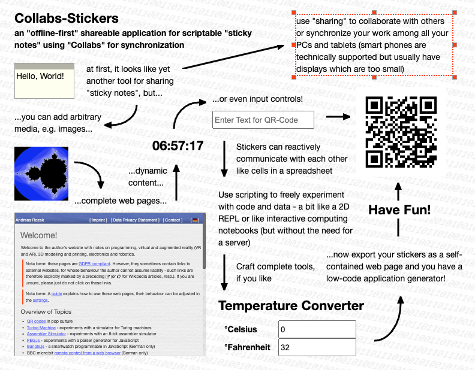

# collabs-stickers #

an "offline-first" shareable application for scriptable sticky notes using "Collabs" for synchronization

(work in progress, see [note-stickers](https://github.com/rozek/note-stickers) for an unshareable variant of this web application)

## License ##

[MIT License](LICENSE.md)
